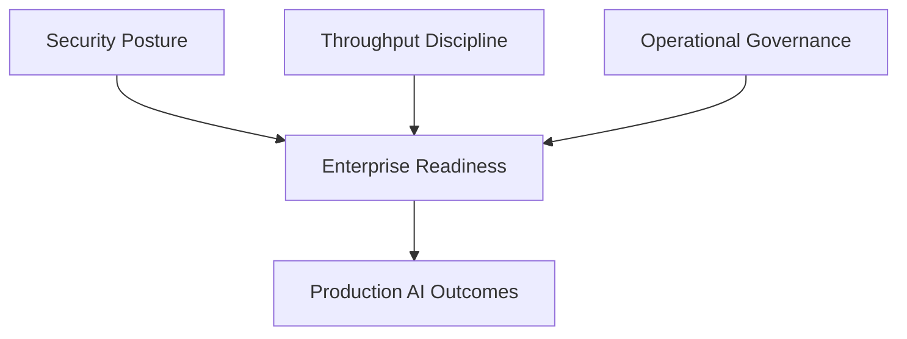

# Basalt Engine (Public)

**Secure AI execution fabric for enterprise-grade throughput, control, and auditability.**

Basalt Engine is my flagship platform program. It is designed for operators who need performance and security at the same time, not as a tradeoff.

## Core Positioning
Most AI stacks optimize for demo speed. Basalt is engineered for production survivability: policy-enforced execution, deterministic orchestration, and resilient throughput under real constraints.

## What Basalt Is Built To Deliver
- Security-first orchestration across model and tool execution paths
- Throughput-oriented coordination without dropping governance controls
- Auditable execution boundaries for enterprise and regulated environments
- Reliable multi-agent and multi-model task routing under policy

## Visual Snapshot (Non-Architectural)

## Public Performance Markers
- Task throughput per compute unit under policy enforcement
- Latency stability at mixed-workload concurrency
- Recovery rate for failed or interrupted task handoffs
- Policy-violation prevention under adversarial traffic patterns

## Strategic Fit
Basalt aligns with cloud providers, model platforms, and enterprise operators that need hardened AI infrastructure with measurable execution quality.

## Collaboration
I engage selectively on architecture diligence, integration strategy, and deployment planning.

## Public Boundary
This repository is intentionally high-level.

It does **not** contain proprietary code, private architecture internals, key material, or trade-secret security mechanics.
